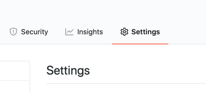
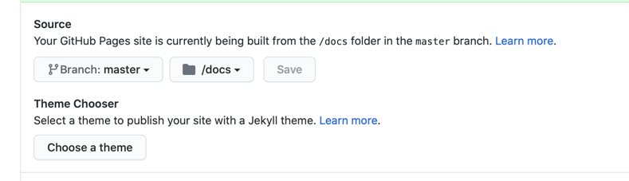
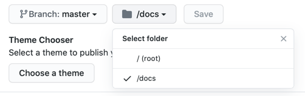

# mdsplit

> Generate your documentation from bulky README.md files

<p align="center">
    <a href="https://alandefreitas.github.io/mdsplit/">
        
    </a>
</p>

<br/>

Github is full of mid-sized projects that help us solve specific tasks. Authors tend to document these repositories with beautiful README.md files and some auxiliary documents. `mdsplit` is a tool to automatically split and adjust these bulky markdown files into smaller files. The new files automatically produce documentation compatible with GitHub Pages. It can also be integrated with GitHub Actions to regenerate the documentation whenever your `README.md` file is updated.

<!-- START mdsplit-ignore -->
<br/>

See the mdsplit [LIVE DEMO](https://alandefreitas.github.io/mdsplit/) and compare it with this very [`README.md`](README.md) file.
<!-- END mdsplit-ignore -->

<br/>

[](https://github.com/alandefreitas/mdsplit/actions?query=workflow%3A%22Build+mdsplit%22+event%3Apush)
[](https://GitHub.com/alandefreitas/mdsplit/releases/)
[](https://alandefreitas.github.io/mdsplit/)

<br/>

[](https://www.facebook.com/sharer/sharer.php?t=mdsplit:%20split%20a%20bulky%20README.md%20into%20a%20nice%20documentation&u=https://github.com/alandefreitas/mdsplit/)
[](http://sns.qzone.qq.com/cgi-bin/qzshare/cgi_qzshare_onekey?url=https://github.com/alandefreitas/mdsplit/&title=mdsplit:%20split%20a%20bulky%20README.md%20into%20a%20nice%20documentation&summary=mdsplit:%20split%20a%20bulky%20README.md%20into%20a%20nice%20documentation)
[](http://sns.qzone.qq.com/cgi-bin/qzshare/cgi_qzshare_onekey?url=https://github.com/alandefreitas/mdsplit/&title=mdsplit:%20split%20a%20bulky%20README.md%20into%20a%20nice%20documentation&summary=mdsplit:%20split%20a%20bulky%20README.md%20into%20a%20nice%20documentation)
[](http://www.reddit.com/submit?url=https://github.com/alandefreitas/mdsplit/&title=mdsplit:%20split%20a%20bulky%20README.md%20into%20a%20nice%20documentation)
[](https://twitter.com/intent/tweet?text=mdsplit:%20split%20a%20bulky%20README.md%20into%20a%20nice%20documentation&url=https://github.com/alandefreitas/mdsplit/&hashtags=Markdown,Documentation,DocumentationGenerator,GithubPages)
[](https://www.linkedin.com/shareArticle?mini=false&url=https://github.com/alandefreitas/mdsplit/&title=mdsplit:%20split%20a%20bulky%20README.md%20into%20a%20nice%20documentation)
[](https://api.whatsapp.com/send?text=mdsplit:%20split%20a%20bulky%20README.md%20into%20a%20nice%20documentation:+https://github.com/alandefreitas/mdsplit/)
[](https://lineit.line.me/share/ui?url=https://github.com/alandefreitas/mdsplit/&text=mdsplit:%20split%20a%20bulky%20README.md%20into%20a%20nice%20documentation)
[](https://telegram.me/share/url?url=https://github.com/alandefreitas/mdsplit/&text=mdsplit:%20split%20a%20bulky%20README.md%20into%20a%20nice%20documentation)
[](https://news.ycombinator.com/submitlink?u=https://github.com/alandefreitas/mdsplit/&t=mdsplit:%20split%20a%20bulky%20README.md%20into%20a%20nice%20documentation)

<br/>

<!-- https://gist.github.com/jbroadway/2836900 -->
<!-- START doctoc generated TOC please keep comment here to allow auto update -->
<!-- DON'T EDIT THIS SECTION, INSTEAD RE-RUN doctoc TO UPDATE -->
<details>
<summary>Table of Contents</summary>

- [Gallery](#gallery)
- [Examples](#examples)
  - [Splitting your README.md](#splitting-your-readmemd)
  - [GitHub Pages](#github-pages)
  - [Extra pages](#extra-pages)
  - [Github Actions](#github-actions)
  - [Testing Locally](#testing-locally)
- [Options](#options)
  - [Links to Repository](#links-to-repository)
  - [Input file](#input-file)
  - [Output directory](#output-directory)
  - [Remove HTML Tags](#remove-html-tags)
  - [Front matter](#front-matter)
  - [Hiding sections from docs](#hiding-sections-from-docs)
  - [Removing old sections](#removing-old-sections)
- [Installing](#installing)
  - [Binaries](#binaries)
  - [Install from Source](#install-from-source)
- [Contributing](#contributing)
- [Developers](#developers)

</details>
<!-- END doctoc generated TOC please keep comment here to allow auto update -->

<br/>

## Gallery

These are some projects that use `mdsplit` for their documentation. Use the links below to compare their documentation with the README.md files.

|                 |     Documentation    |    README.md    |
|-----------------|----------------------|-----------------|
| Matplot++       | [URL](https://alandefreitas.github.io/matplotplusplus/) | [URL](https://github.com/alandefreitas/matplotplusplus/blob/master/README.md) |
| pareto-front    | [URL](https://alandefreitas.github.io/pareto-front/) | [URL](https://github.com/alandefreitas/pareto-front/blob/master/README.md) |
| BibExplorer    | [URL](https://alandefreitas.github.io/bibexplorer/) | [URL](https://github.com/alandefreitas/bibexplorer/blob/master/README.md) |
| mdsplit         | [URL](https://alandefreitas.github.io/mdsplit/) | [URL](https://github.com/alandefreitas/mdsplit/blob/master/README.md) |

Please let me know if you want to list your project here.

## Examples

### Splitting your README.md

After [installing](#installing) `mdsplit`, run

```
mdsplit -r username/repository
```

from your project root directory to generate your documentation. 

`mdsplit` will split your `README.md` file into smaller files and save the results to the `docs` directory. 

### GitHub Pages

You can use the new `.md` files with GitHub Pages to host your documentation. 

Go to your repository settings.



Turn on GitHub Pages and set `./docs` as your root directory.



Run `mdsplit` as described in the [previous section](#splitting-your-readmemd) from your root directory to save the files in `./docs`.

Create a new `_config.yml` file in `./docs`. To get started, adapt this file with your repository name:

```yaml
remote_theme: pmarsceill/just-the-docs
title: "my_repository_name"
description: "My Repository Description"

search_enabled: true

aux_links:
  "my_repository_name on github":
    - "//github.com/my_username/my_repository_name"

aux_links_new_tab: true
```

See an example in [`docs/_config.yml`](docs/_config.yml).

This template uses the `just-the-docs` theme for your documentation. Unlike the default themes for GitHub, `just-the-docs` includes a search bar, and navigation links. `mdsplit` will generate the proper YAML front matter to organize the navigation links.

### Extra pages

The documentation often needs some extra `.md` files. Just put these files in the `docs` directory and it will also be included in your documentation navigation links.

To define where these files will fall inside your documentation, you can edit their YAML front matter (the first lines in your `.md` file). If using the `just-the-docs` theme, you can define the title, navigation order, and page hierarchy with the parameters `title`, `nav_order`, `parent`, and `has_children` You can also use the parameter `nav_exclude` to hide a certain page from the navigation links.

```yaml
---
layout: default
title: Customization
nav_order: 4
parent: UI Components
has_children: true
nav_exclude: false
---  
```

### Github Actions

You can integrate `mdsplit` with GitHub actions to regenerate the documentation whenever you change your `README.md` file. Just create a workflow with the following steps:

Download `mdsplit` to the virtual machine:

```yaml
- name: Download mdsplit
  run: curl <mdsplit_url> -o md_split
``` 

You can get the executable link from the [Release Page](https://GitHub.com/alandefreitas/mdsplit/releases/). You can also change this step to uncompress files or build `mdsplit` from source if you want. 

Run `mdsplit` on the virtual machine:

```yaml
- name: Generate Docs
  run: mdsplit -r my_username/my_repository
``` 

Commit the new doc files:

```yaml
- name: Commit Docs
  run: |
    git add docs
    git config --local user.email "action@github.com"
    git config --local user.name "GitHub Action"
    git commit -m "Update Docs" -a
  continue-on-error: true
```

We allow this step to continue on error because there will be nothing to commit sometimes.

Push the new documentation to your repository:

```yaml
- name: Push changes
  uses: ad-m/github-push-action@master
  if: ${{ success() }}
  with:
    github_token: ${{ secrets.GITHUB_TOKEN }}
```

See an example in [`.github/workflows/docs.yml`](.github/workflows/docs.yml).

### Testing Locally

You might want to test your documentation locally before pushing it to your repository. 

To test your GitHub Page locally, you first need to install [Jekyll](https://jekyllrb.com/docs/installation/) and [Bundler](https://bundler.io) locally.

Then adjust your Jekyll configuration file in [`docs/_config.yml`](docs/_config.yml) to use a local repository for the theme. 

```yaml
#remote_theme: pmarsceill/just-the-docs
theme: "just-the-docs"
```

Create a [`docs/Gemfile`](docs/Gemfile) with 

```bash
bundle init
```

And include the following commands to install `github-pages` and `just-the-docs`:   

```
gem "github-pages", group: :jekyll_plugins
gem "just-the-docs"
```

See an example in [`docs/Gemfile`](docs/Gemfile).

Install these gems with 

```bash
bundle install
```

for the first time or 

```bash
bundle update
```

after that.

Adjust your Jekyll configuration file in [`docs/_config.yml`](docs/_config.yml) to use the local repository for the theme. 

```yaml
#remote_theme: pmarsceill/just-the-docs
theme: "just-the-docs"
```

Run the jekyll server with: 

```bash
bundle exec jekyll serve
```

## Options

Run `mdsplit` with the `--help` (or `-h`) option to see all command-line options:

```bash
mdsplit -h
```

```console
Generate documentation from README.md files
Usage:
  mdsplit -i input_directory -o output_directory -r username/repository

 File options:
  -i, --input arg       Input file (default: README.md)
  -o, --output arg      Output directory (default: docs)
  -r, --repository arg  Output repository

 Behaviour options:
  -l, --level arg        Max level for which we should split the file
                         (default: 6)
  -c, --clear-html arg   List of HTML tags mdsplit should clear (default:
                         details,summary)
  -t, --toc              Create a table of contents for the new files
                         (default: true)
  -j, --jekyll-escape    Escape consecutive "{{"s for Jekyll processing
                         (default: true)
      --header-reindent  Reindent headers to match the new files (default:
                         true)
  -f, --front-matter     Include a front-matter in the new files (default:
                         true)
  -u, --url-update       Update relative URLs to their new relative paths
                         (default: true)
      --remove-auto-toc  Remove automatic table of contents (default: true)
      --trace            Trace commands (default: true)

 Help options:
  -h, --help     Print usage
  -v, --version  Print version
```

### Links to Repository

The `--repository` (or `-r`) option should be used to provide your repository name to `mdsplit`. This option enables `mdsplit` to create links to files inside the repository.

Although all internal repository links work in GitHub, not all internal links are adjusted to work with GitHub Pages. Documentation files can only contain links to other markdown files in the documentation directory.

If your documentation needs to refer to a file in the repository and this file is not under `.docs/`, links need to use the absolute repository link as a parent path. 

For instance, conside a file `source/main.cpp` outside `docs`. Then

```markdown
[My Internal Link](source/main.cpp)
```

should become

```markdown
[My Internal Link](https://github.com/my_username/my_repository/blob/master/source/main.cpp)
```

so that the link works correctly on GitHub pages.

You can use the `--repository` (or `-r`) option to provide the repository `mdsplit` should consider to generate these links:

```
mdsplit -r alandefreitas/matplotplusplus
```

### Input file

The `--input` (or `-i`) option defines the file `mdsplit` should split to generate the documentation. You don't usually want to change the default from `README.md` because that's the file GitHub uses for all repositories.

However, it might be useful to use another file as input if you want to have your documentation in a bulky markdown file kept separate from your main `README.md`. 

### Output directory

The `--output` (or `-o`) option defines the directory where `mdsplit` should store the documentation. You don't usually want to change the default from `docs` because GitHub Pages gives you only two options for the documentation directory:



And cluttering the root directory with lots of markdown files and directories is not a good idea unless you are going to create another branch for your documentation.  

### Remove HTML Tags

The `--clear-html` (or `-d`) option defines the HTML tags `mdsplit` should remove from your `README.md`. This is useful to `README.md` files that use tags such as `details` and `summary` to emulate what the documentation would look like inside the `README.md` file.  

By default, `mdsplit` will remove the tags `details` and `summary` because 1) Jekyll themes often have difficulty with these tags and 2) people often use these tags in markdown files to emulate what the documentation would look like.  

### Front matter 

The `--front-matter` (or `-f`) option tells `mdsplit` to generate a front matter for each new file. The default option is `true` so you need `--front-matter=false` to turn it off.

This front matter includes parameters such as `title`, `nav_order`, `parent`, `has_children`, and `nav_exclude` for each markdown file. 

Jekyll themes can use these parameters to generate proper navigation bars, order pages, and define page titles. The `just-the-docs` theme already uses all of these parameters.

### Hiding sections from docs

Use the comments `<!-- START mdsplit-ignore -->` and `<!-- END mdsplit-ignore -->` to ignore sections from your `README.md`. For instance:

```markdown
<!-- START mdsplit-ignore -->
# Section to ignore

`mdsplit` will remove this whole section from your documentation.

<!-- END mdsplit-ignore -->
```

or

```markdown
# Section to ignore

<!-- START mdsplit-ignore -->
`mdsplit` will remove this paragraph from your documentation.
<!-- END mdsplit-ignore -->
```

If you ignore the complete section, `mdsplit` will create no file for that section.

If you're reading this from [`README.md`](README.md) you will see this section has a subsection that will be completely ignored in the documentation. 

<!-- START mdsplit-ignore -->
#### Ignored section

This section will be completely ignored by the documentation. Have a look at the Section [Hiding sections from docs](https://alandefreitas.github.io/mdsplit/options/hiding-sections-from-docs.html) in the documentation.
<!-- END mdsplit-ignore -->

### Removing old sections

In principle, `mdsplit` will not remove any files in your documentation directory. It will only create or update files. This is meant to allow auxiliary files that you also want to be part of the documentation.

However, that also means that if you change your section names in `README.md`, `mdsplit` will create a new file for this section and the old file would be left untouched. Your GitHub pages would then show you the new and old sections. 

If this is not an auxiliary file you want in your documentation, you need to remove these files. 

To make it easier to identify external auxiliary files, after saving the new markdown files, `mdsplit` will look for any `.md` files in the `docs` directory. If there are any files not generated by `mdsplit`, it will emit a message like the following:

```
# The following .md files were not generated by mdsplit
# Please make sure that is on purpose:
Outsider doc file: docs/README.md
Outsider doc file: docs/COMPLETE_GALLERY.md
``` 

If any of these files contain a comment indicating that `mdsplit` generated the file, then `mdsplit` might automatically remove the file. You can control this behaviour with the `--erase-old-mdsplit-files` (or `-e`) option. The default value is `true` so you need `--erase-old-mdsplit-files=false` to turn it off.

## Installing

### Binaries

Get the latest release from the [Release Page](https://GitHub.com/alandefreitas/mdsplit/releases/) or download the latest binaries from the [CI Artifacts](https://github.com/alandefreitas/mdsplit/actions?query=workflow%3A%22Build+mdsplit%22+event%3Apush).

### Install from Source

```bash
mkdir build
cmake -version
cmake .. -DCMAKE_BUILD_TYPE=Release -DCMAKE_CXX_FLAGS="-O2"
cmake --build . -j 2 --config Release
cmake --install .
cpack
```

On windows, replace `-O2` with `/O2`. On Linux, you might need `sudo` for this last command.


## Contributing

If contributing with code, please leave the pedantic mode ON (` -DBUILD_WITH_PEDANTIC_WARNINGS=ON`), use [cppcheck](http://cppcheck.sourceforge.net), and [clang-format](https://clang.llvm.org/docs/ClangFormat.html).

<details>
    <summary>Example: CLion</summary>
    

    
</details>

## Developers

<!-- readme: collaborators,contributors -start --> 
<!-- readme: collaborators,contributors -end -->

