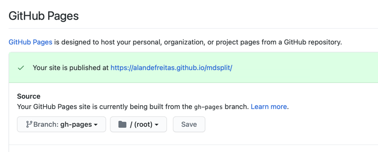
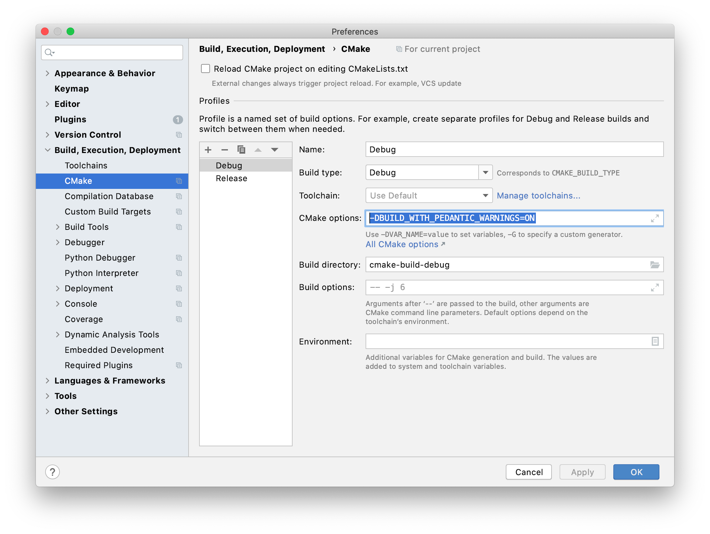

# mdsplit

> Generate your documentation from bulky README.md files

<p align="center">
    <a href="https://alandefreitas.github.io/mdsplit/">
        
    </a>
</p>

<br/>

Github is full of mid-sized projects that help us solve specific tasks. Authors tend to document these repositories with
beautiful README.md files and some auxiliary documents.

`mdsplit` is a tool that splits these bulky README.md files into smaller files in a way compatible with GitHub Pages +
GitHub Actions + MkDocs. GitHub Actions will then regenerate the documentation whenever your `README.md` file is
updated.

<!-- START mdsplit-ignore -->
<br/>

See the mdsplit [LIVE DEMO](https://alandefreitas.github.io/mdsplit/) and compare it with this
very [`README.md`](README.md) file.
<!-- END mdsplit-ignore -->

<br/>

[](https://github.com/alandefreitas/mdsplit/actions?query=workflow%3A%22Build+mdsplit%22+event%3Apush)
[](https://GitHub.com/alandefreitas/mdsplit/releases/)
[](https://alandefreitas.github.io/mdsplit/)
[](https://github.com/alandefreitas/mdsplit/discussions)

<br/>

[](https://www.facebook.com/sharer/sharer.php?t=mdsplit:%20split%20a%20bulky%20README.md%20into%20a%20nice%20documentation&u=https://github.com/alandefreitas/mdsplit/)
[](http://sns.qzone.qq.com/cgi-bin/qzshare/cgi_qzshare_onekey?url=https://github.com/alandefreitas/mdsplit/&title=mdsplit:%20split%20a%20bulky%20README.md%20into%20a%20nice%20documentation&summary=mdsplit:%20split%20a%20bulky%20README.md%20into%20a%20nice%20documentation)
[](http://sns.qzone.qq.com/cgi-bin/qzshare/cgi_qzshare_onekey?url=https://github.com/alandefreitas/mdsplit/&title=mdsplit:%20split%20a%20bulky%20README.md%20into%20a%20nice%20documentation&summary=mdsplit:%20split%20a%20bulky%20README.md%20into%20a%20nice%20documentation)
[](http://www.reddit.com/submit?url=https://github.com/alandefreitas/mdsplit/&title=mdsplit:%20split%20a%20bulky%20README.md%20into%20a%20nice%20documentation)
[](https://twitter.com/intent/tweet?text=mdsplit:%20split%20a%20bulky%20README.md%20into%20a%20nice%20documentation&url=https://github.com/alandefreitas/mdsplit/&hashtags=Markdown,Documentation,DocumentationGenerator,GithubPages)
[](https://www.linkedin.com/shareArticle?mini=false&url=https://github.com/alandefreitas/mdsplit/&title=mdsplit:%20split%20a%20bulky%20README.md%20into%20a%20nice%20documentation)
[](https://api.whatsapp.com/send?text=mdsplit:%20split%20a%20bulky%20README.md%20into%20a%20nice%20documentation:+https://github.com/alandefreitas/mdsplit/)
[](https://lineit.line.me/share/ui?url=https://github.com/alandefreitas/mdsplit/&text=mdsplit:%20split%20a%20bulky%20README.md%20into%20a%20nice%20documentation)
[](https://telegram.me/share/url?url=https://github.com/alandefreitas/mdsplit/&text=mdsplit:%20split%20a%20bulky%20README.md%20into%20a%20nice%20documentation)
[](https://news.ycombinator.com/submitlink?u=https://github.com/alandefreitas/mdsplit/&t=mdsplit:%20split%20a%20bulky%20README.md%20into%20a%20nice%20documentation)

<br/>

<!-- https://gist.github.com/jbroadway/2836900 -->
<!-- START doctoc generated TOC please keep comment here to allow auto update -->
<!-- DON'T EDIT THIS SECTION, INSTEAD RE-RUN doctoc TO UPDATE -->
<details>
<summary>Table of Contents</summary>

- [Examples](#examples)
  - [Splitting your README.md](#splitting-your-readmemd)
  - [GitHub Pages](#github-pages)
  - [Extra pages](#extra-pages)
  - [Github Actions](#github-actions)
  - [Testing Locally](#testing-locally)
- [Options](#options)
  - [Links to Repository](#links-to-repository)
  - [Input file](#input-file)
  - [Output directory](#output-directory)
  - [Remove HTML Tags](#remove-html-tags)
  - [Front matter](#front-matter)
  - [Hiding sections from docs](#hiding-sections-from-docs)
  - [Removing old sections](#removing-old-sections)
- [Installing](#installing)
  - [Binaries](#binaries)
  - [Install from Source](#install-from-source)
- [Gallery](#gallery)
- [Contributing](#contributing)
  - [Contributors](#contributors)

</details>
<!-- END doctoc generated TOC please keep comment here to allow auto update -->

<br/>

# Quick Start

Go to your repository settings and turn on GitHub Pages on the branch gh-pages.



Copy the [`mkdocs.yml`](mkdocs.yml) file to your repository:

??? info "See contents"

    === "mkdocs.yml"
    
        ```yaml hl_lines="1 2 3 4 6 30"
        --8<-- "mkdocs.yml"
        ```

Copy the [`.github/workflows/docs.yml`](mkdocs.yml) file to your repository:

??? info "See contents"

    === "docs.yml"
    
        ```yaml hl_lines="21 22 31-44 48"
        --8<-- ".github/workflows/docs.yml"
        ```

In a few seconds, your README.md file will become a beautiful documentation.

## Step-by-Step

### Splitting Locally

After [installing](#binaries) `mdsplit`, run

```bash
mdsplit -r username/repository
```

from your project root directory to generate your documentation.

`mdsplit` will split your `README.md` file into smaller files and save the results to the `docs` directory.

!!! note This is directory from where mkdocs will later build your documentation.

### Testing Locally

You might want to test your documentation locally before pushing it to your repository.

Install mkdocs with

```bash
pip install mkdocs-material
```

After generating the docs with mdsplit, run the mkdocs server with

```bash
mkdocs serve
```

Or build the static documentation with

```bash
mkdocs serve
```

Use this mkdocs configuration file to get started:

=== "mkdocs.yml"

```yaml hl_lines="1 2 3 4 6 30"
--8<-- "mkdocs.yml"
```

Replace the settings with your repository information.

### Github Actions

You can integrate `mdsplit` with GitHub actions to regenerate the documentation whenever you change your `README.md`
file.

Use this workflow to get started:

=== ".github/workflows/docs.yml"

    ```yaml hl_lines="21 22 31-44 48"
    --8<-- ".github/workflows/docs.yml"
    ```

Replace the settings with your repository information.

Most steps in this workflow are optional:

* The step `technote-space/toc-generator@v2` creates a table of contents for your README.md file
* The second step downloads and builds the master version of mdsplit. This is the version we use in this repository, but
  you probably want to use a more stable version in your own repository. To do that, comment this step and use the third
  and forth steps instead.
* The third and fourth steps (commented out) download the latest release version of mdsplit. That's probably what you
  want for your repository. Uncomment these steps to do that.
* The next steps are pushing the docs to your master branch. Make any adjustments you might need.
* The last steps are taking the docs from your master branch and publishing them to your gh-pages branch.

## Options

Run `mdsplit` with the `--help` (or `-h`) option to see all the command-line options:

```bash
mdsplit -h
```

```console
Generate documentation from README.md files
Usage:
  mdsplit -i input_directory -o output_directory -r username/repository

 File options:
  -i, --input arg       Input file (default: README.md)
  -o, --output arg      Output directory (default: docs)
  -r, --repository arg  Output repository

 Behaviour options:
  -l, --level arg        Max level for which we should split the file
                         (default: 6)
  -c, --clear-html arg   List of HTML tags mdsplit should clear (default:
                         details,summary)
  -t, --toc              Create a table of contents for the new files
                         (default: true)
  -j, --jekyll-escape    Escape consecutive "{{"s for Jekyll processing
                         (default: true)
      --header-reindent  Reindent headers to match the new files (default:
                         true)
  -f, --front-matter     Include a front-matter in the new files (default:
                         true)
  -u, --url-update       Update relative URLs to their new relative paths
                         (default: true)
      --remove-auto-toc  Remove automatic table of contents (default: true)
      --trace            Trace commands (default: true)

 Help options:
  -h, --help     Print usage
  -v, --version  Print version
```

### Links to Repository

The `--repository` (or `-r`) option should be used to provide your repository name to `mdsplit`. This option enables `mdsplit` to create links to files inside the repository.

Although all internal repository links work in GitHub, not all internal links are adjusted to work with GitHub Pages.
Documentation files can only contain links to other markdown files in the documentation directory.

If your documentation needs to refer to a file in the repository and this file is not under `.docs/`, links need to use
the absolute repository link as a parent path.

For instance, consider a file `source/main.cpp` outside `docs`. Then

```md
[My Internal Link](source/main.cpp)
```

should become

```md
[My Internal Link](https://github.com/my_username/my_repository/blob/master/source/main.cpp)
```

so that the link works correctly on GitHub pages.

You can use the `--repository` (or `-r`) option to provide the repository `mdsplit` should consider to generate these
links:

```bash
mdsplit -r alandefreitas/matplotplusplus
```

### Hiding sections

Use the comments `<!-- START mdsplit-ignore -->` and `<!-- END mdsplit-ignore -->` to ignore sections from
your `README.md`. For instance:

=== "Markdown"

    ```md
    <!-- START mdsplit-ignore -->
    # Section to ignore
    
    `mdsplit` will remove this whole section from your documentation.
    
    <!-- END mdsplit-ignore -->
    ```

or

=== "Markdown"

    ```md
    # Section to ignore
    
    <!-- START mdsplit-ignore -->
    `mdsplit` will remove this paragraph from your documentation.
    <!-- END mdsplit-ignore -->
    ```

If you ignore the complete section, `mdsplit` will create no file for that section.

If you're reading this from [`README.md`](README.md) you will see this section has a subsection that will be completely
ignored in the documentation.

<!-- START mdsplit-ignore -->

#### Ignored section

This section will be completely ignored by the documentation. Have a look at the
Section [Hiding sections from docs](https://alandefreitas.github.io/mdsplit/options/hiding-sections-from-docs.html) in
the documentation.
<!-- END mdsplit-ignore -->

### Input file

The `--input` (or `-i`) option defines the file `mdsplit` should split to generate the documentation. You don't usually
want to change the default from `README.md` because that's the file GitHub uses for all repositories.

However, it might be useful to use another file as input if you want to have your documentation in a bulky markdown file
kept separate from your main `README.md`.

### Output directory

The `--output` (or `-o`) option defines the directory where `mdsplit` should store the documentation. You don't usually want to change the default from `docs` because GitHub Pages gives you only two options for the documentation directory:


And cluttering the root directory with lots of markdown files and directories is not a good idea unless you are going to
create another branch for your documentation.

### Remove HTML Tags

The `--clear-html` (or `-d`) option defines the HTML tags `mdsplit` should remove from your `README.md`. This is useful
to `README.md` files that use tags such as `details` and `summary` to emulate what the documentation would look like
inside the `README.md` file.

By default, `mdsplit` will remove the tags `details` and `summary` because 1) Jekyll themes often have difficulty with
these tags and 2) people often use these tags in markdown files to emulate what the documentation would look like.

### Front matter

The `--front-matter` (or `-f`) option tells `mdsplit` to generate a front matter for each new file. The default option
is `true` so you need `--front-matter=false` to turn it off.

This front matter includes parameters such as `title`, `nav_order`, `parent`, `has_children`, and `nav_exclude` for each
markdown file.

Jekyll themes can use these parameters to generate proper navigation bars, order pages, and define page titles.

### Removing old sections

In principle, `mdsplit` will not remove any files in your documentation directory. It will only create or update files.
This is meant to allow auxiliary files that you also want to be part of the documentation.

However, that also means that if you change your section names in `README.md`, `mdsplit` will create a new file for this
section and the old file would be left untouched. Your GitHub pages would then show you the new and old sections.

If this is not an auxiliary file you want in your documentation, you need to remove these files.

To make it easier to identify external auxiliary files, after saving the new markdown files, `mdsplit` will look for
any `.md` files in the `docs` directory. If there are any files not generated by `mdsplit`, it will emit a message like
the following:

=== "Output"

    ```console
    # The following .md files were not generated by mdsplit
    # Please make sure that is on purpose:
    Outsider doc file: docs/README.md
    Outsider doc file: docs/COMPLETE_GALLERY.md
    ``` 

If any of these files contain a comment indicating that `mdsplit` generated the file, then `mdsplit` might automatically
remove the file. You can control this behaviour with the `--erase-old-mdsplit-files` (or `-e`) option. The default value
is `true` so you need `--erase-old-mdsplit-files=false` to turn it off.

## Installing

### Binaries

Get the latest release from the [Release Page](https://GitHub.com/alandefreitas/mdsplit/releases/) or download the
latest binaries from
the [CI Artifacts](https://github.com/alandefreitas/mdsplit/actions?query=workflow%3A%22Build+mdsplit%22+event%3Apush).

### Install from Source

To install from the source files:

=== "Windows"

    ```bash
    mkdir build
    cmake .. -DCMAKE_BUILD_TYPE=Release -DCMAKE_CXX_FLAGS="/O2"
    cmake --build . -j 2 --config Release
    cmake --install .
    ```

=== "Linux"

    ```bash
    mkdir build
    cmake .. -DCMAKE_BUILD_TYPE=Release -DCMAKE_CXX_FLAGS="-O2"
    cmake --build . -j 2 --config Release
    sudo cmake --install .
    ```

=== "Mac OS"

    ```bash
    mkdir build
    cmake .. -DCMAKE_BUILD_TYPE=Release -DCMAKE_CXX_FLAGS="-O2"
    cmake --build . -j 2 --config Release
    cmake --install .
    ```

The dependencies are CMake 3.17 and C++17.

## Gallery

These are some projects that use `mdsplit`. Use the links below to compare their documentation with the README.md files.

| Repository      |     Documentation    |    README.md    |
|-----------------|----------------------|-----------------|
| Matplot++       | [URL](https://alandefreitas.github.io/matplotplusplus/) | [URL](https://github.com/alandefreitas/matplotplusplus/blob/master/README.md) |
| Pareto    | [URL](https://alandefreitas.github.io/pareto/) | [URL](https://github.com/alandefreitas/pareto/blob/master/README.md) |
| BibExplorer    | [URL](https://alandefreitas.github.io/bibexplorer/) | [URL](https://github.com/alandefreitas/bibexplorer/blob/master/README.md) |
| mdsplit itself    | [URL](https://alandefreitas.github.io/mdsplit/) | [URL](https://github.com/alandefreitas/mdsplit/blob/master/README.md) |

!!! note Let me know if you want to list your project here.

## Contributing

### Guidelines

If contributing with code, please leave the pedantic mode ON (` -DBUILD_WITH_PEDANTIC_WARNINGS=ON`),
use [cppcheck](http://cppcheck.sourceforge.net), and [clang-format](https://clang.llvm.org/docs/ClangFormat.html).

<details>
    <summary>Example: CLion</summary>



</details>

### Contributors

<!-- readme: collaborators,contributors -start --> 
<table>
<tr>
    <td align="center">
        <a href="https://github.com/alandefreitas">
            
            <br />
            <sub><b>Alan De Freitas</b></sub>
        </a>
    </td>
    <td align="center">
        <a href="https://github.com/actions-user">
            
            <br />
            <sub><b>actions-user</b></sub>
        </a>
    </td></tr>
</table>
<!-- readme: collaborators,contributors -end -->

