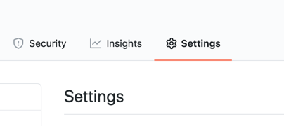
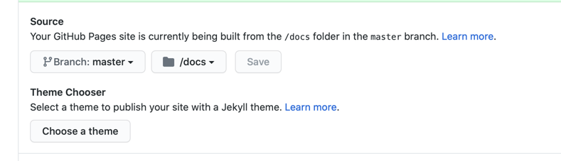

# GitHub Pages

You can use the new `.md` files with GitHub Pages to host your documentation.

Go to your repository settings.



Turn on GitHub Pages and set `./docs` as your root directory.



Run `mdsplit` as described in the [previous section](splitting-your-readmemd.md) from your root directory to save the files in `./docs`.

Create a new `_config.yml` file in `./docs`. To get started, adapt this file with your repository name:

```yaml
remote_theme: pmarsceill/just-the-docs
title: "my_repository_name"
description: "My Repository Description"

search_enabled: true

aux_links:
  "my_repository_name on github":
    - "//github.com/my_username/my_repository_name"

aux_links_new_tab: true
```

See an example in [`docs/_config.yml`](../_config.yml).

This template uses the `just-the-docs` theme for your documentation. Unlike the default themes for GitHub, `just-the-docs` includes a search bar, and navigation links. `mdsplit` will generate the proper YAML front matter to organize the navigation links.


<!-- Generated with mdsplit: https://github.com/alandefreitas/mdsplit -->
