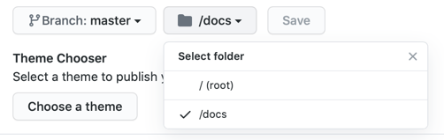

# Output directory

The `--output` (or `-o`) option defines the directory where `mdsplit` should store the documentation. You don't usually want to change the default from `docs` because GitHub Pages gives you only two options for the documentation directory:

And cluttering the root directory with lots of markdown files and directories is not a good idea unless you are going to
create another branch for your documentation.

<!-- Generated with mdsplit: https://github.com/alandefreitas/mdsplit -->
