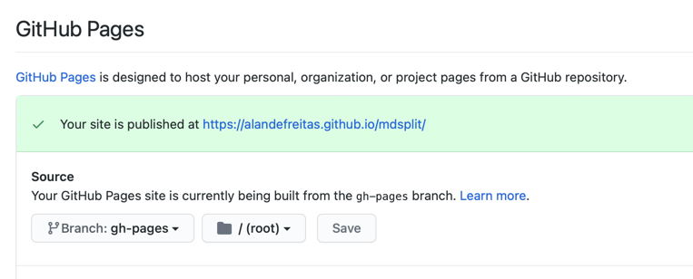

# Quick Start

Go to your repository settings and turn on GitHub Pages on the branch gh-pages.



Copy the [`mkdocs.yml`](https://github.com/alandefreitas/mdsplit/blob/master/mkdocs.yml) file to your repository:

??? info "See contents"

    === "mkdocs.yml"
    
        ```yaml hl_lines="1 2 3 4 6 30"
        --8<-- "mkdocs.yml"
        ```

Copy the [`.github/workflows/docs.yml`](https://github.com/alandefreitas/mdsplit/blob/master/mkdocs.yml) file to your repository:

??? info "See contents"

    === "docs.yml"
    
        ```yaml hl_lines="21 22 31-44 48"
        --8<-- ".github/workflows/docs.yml"
        ```

In a few seconds, your README.md file will become a beautiful documentation.


<!-- Generated with mdsplit: https://github.com/alandefreitas/mdsplit -->
